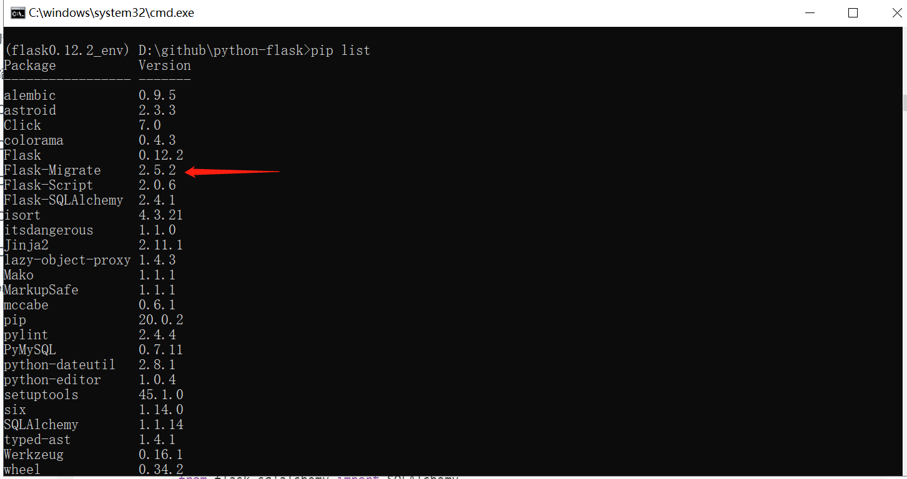

### 506.【Flask数据库】Flask-Migrate详细讲解[链接](http://wangkaixiang.cn/python-flask/di-ba-zhang-ff1a-flask-migrate.html)

### flask_migrate笔记：
> 在实际的开发环境中，经常会发生数据库修改的行为。一般我们修改数据库不会直接手动的去修改，
> 而是去修改ORM对应的模型，然后再把模型映射到数据库中。这时候如果有一个工具能专门做这种
> 事情，就显得非常有用了，而`flask-migrate`就是做这个事情的。`flask-migrate`是基于
> `Alembic`进行的一个封装，并集成到`Flask`中，而所有的迁移操作其实都是`Alembic`做的，
> 他能跟踪模型的变化，并将变化映射到数据库中。

### 安装[链接](https://github.com/miguelgrinberg/flask-migrate/)
```shell script
pip install flask-migrate
```


### 1.创建`manage.py`文件
```python
from flask_script import Manager
from app import app
from models import db
from flask_migrate import Migrate, MigrateCommand

manage = Manager(app=app)
migrate = Migrate(app=app, db=db)
manage.add_command('db', MigrateCommand)

if __name__ == '__main__':
    manage.run()
```

### 2.flask_migrate常用命令：
* 1.初始化一个环境：`python manage.py db init`，后生成`migrations`文件夹
    > 类似于`alembic init alembic`
    ```shell script
    (flask0.12.2_env) D:\github\python-flask\506>python manage.py db init
    ```
    
* 2.自动检测模型，生成迁移脚本：`python manage.py db migrate`
    > 类似于`alembic revision --autogenerate -m "message"`
    ```shell script
    (flask0.12.2_env) D:\github\python-flask\506>python manage.py db migrate
    ```
* 3.将迁移脚本映射到数据库中：`python manage.py db upgrade`
    > 类似于`alembic upgrade head`
    ```shell script
    (flask0.12.2_env) D:\github\python-flask\506>python manage.py db upgrade
    ```
    
* 4.更多命令：`python manage.py db --help`
    ```shell script
    (flask0.12.2_env) D:\github\python-flask\506>python manage.py db --help
    ```
    
  
### 3.更改模型，重新执行2.2、2.3操作即可
#### 新增模型字段代码示例
```python
from exts import db
from datetime import datetime


# TODO: 定义User模型
class User(db.Model):
    __tablename__ = 'user'
    id = db.Column(db.Integer, primary_key=True, autoincrement=True)
    name = db.Column(db.String(50), nullable=True)
    age = db.Column(db.Integer, nullable=False)
    create_time = db.Column(db.DATETIME, default=datetime.now)
    # TODO: 新增模型字段代码示例
    country = db.Column(db.String(50), nullable=False, default='china')
    areacode = db.Column(db.Integer, nullable=False, default=86)
```

