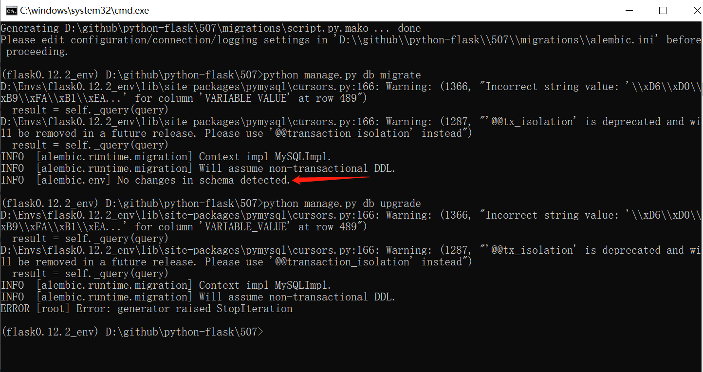
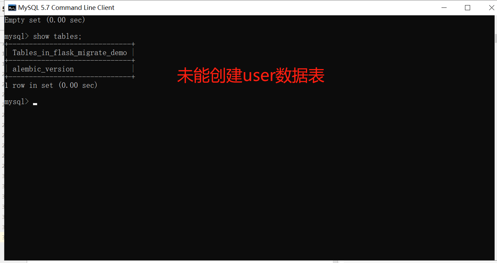
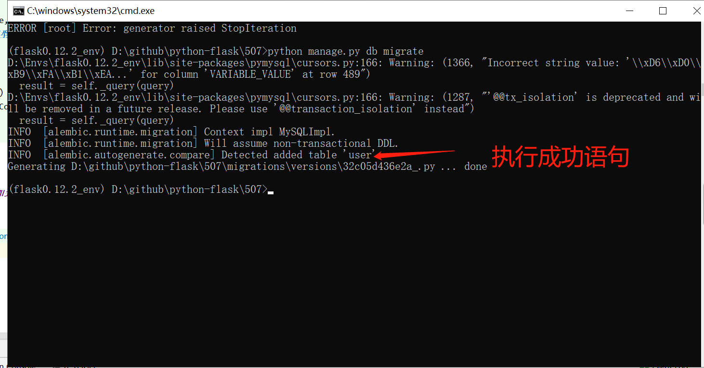
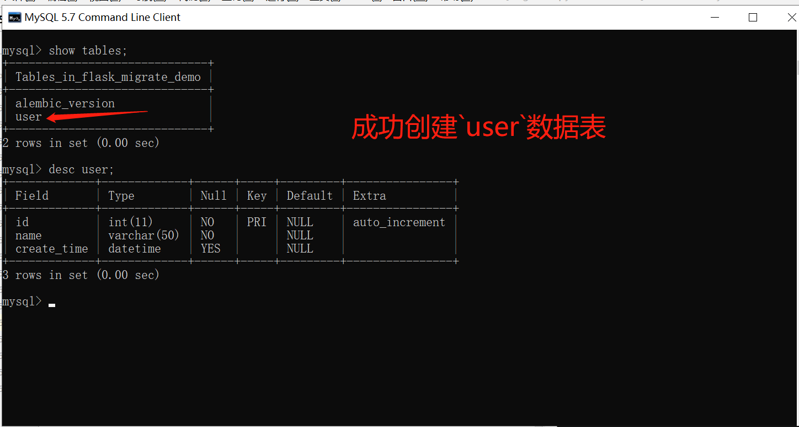

### 507.【Flask数据库】Flask-Migrate注意事项[链接](http://wangkaixiang.cn/python-flask/di-ba-zhang-ff1a-flask-migrate.html)

### 未能映射到数据库，因为未曾导入`User`模型
#### 1.新建`manage.py`文件
```python
from flask_script import Manager
from app import app
from exts import db
from flask_migrate import Migrate, MigrateCommand

manage = Manager(app=app)
migrate = Migrate(app=app, db=db)
manage.add_command('db', MigrateCommand)

if __name__ == '__main__':
    manage.run()
```

#### 2.初始化迁移文件
> python manage.py db init
```shell script
(flask0.12.2_env) D:\github\python-flask\507>python manage.py db init
```

#### 3.运行命令来将模型的映射添加到文件中
> python manage.py db migrate
```shell script
(flask0.12.2_env) D:\github\python-flask\507>python manage.py db migrate
```


#### 4.将映射文件真正的映射到数据库中
> python manage.py db upgrade
```shell script
(flask0.12.2_env) D:\github\python-flask\507>python manage.py db upgrade
```


### 导入`User`模型，重新映射到数据库中

#### 1.修改`manage.py`文件
```python
from flask_script import Manager
from app import app
from exts import db
from flask_migrate import Migrate, MigrateCommand
# TODO: 需要把映射到数据库中的模型导入到manage.py文件中
from models import User

manage = Manager(app=app)
migrate = Migrate(app=app, db=db)
manage.add_command('db', MigrateCommand)

if __name__ == '__main__':
    manage.run()
```

#### 2.运行命令来将模型的映射添加到文件中
> python manage.py db migrate
```shell script
(flask0.12.2_env) D:\github\python-flask\507>python manage.py db migrate
```


#### 3.将映射文件真正的映射到数据库中
> python manage.py db upgrade
```shell script
(flask0.12.2_env) D:\github\python-flask\507>python manage.py db upgrade
```
