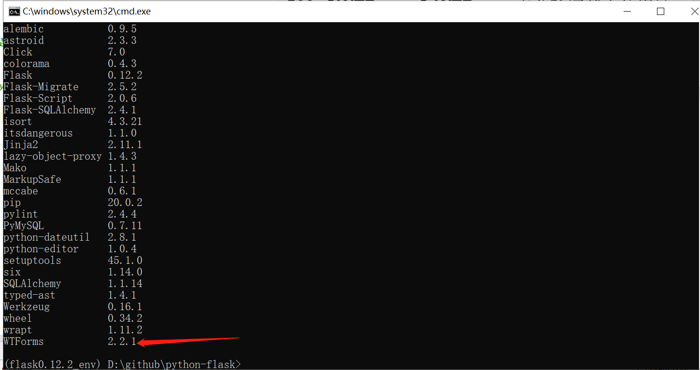

### 508.【WTForms】WTForms表单验证基本使用[链接](http://wangkaixiang.cn/python-flask/di-jiu-zhang-ff1a-flask-wtf.html)

### WTForms笔记：
> 这个库一般有两个作用。
> * 第一个就是做表单验证，把用户提交上来的数据进行验证是否合法。
> * 第二个就是做模版渲染。

### 安装`WTForms`[链接](https://pypi.org/project/WTForms/)
> pip install -U WTForms



### 做表单验证：
* 1.自定义一个表单类，继承自`wtforms.Form类`。
* 2.定义好需要验证的字段，字段的名字必须和模版中那些需要验证的`input标签的name属性值保持一致`。
* 3.在需要验证的字段上，需要指定好具体的数据类型。
* 4.在相关的字段上，指定验证器。
* 5.以后在视图中，就只需要使用这个表单类的对象，并且把需要验证的数据，也就是`request.form`
    传给这个表单类，以后调用`form.validate()`方法，如果`返回True`，那么代表用户输入的数据
    都是合法的，否则代表用户输入的数据是有问题的。如果验证失败了，那么可以通过
    `form.errors来获取具体的错误信息`。
    
### 全部示例代码
```python
from flask import Flask, render_template, url_for, request, jsonify
from wtforms import Form, StringField
from wtforms.validators import Length, EqualTo

app = Flask(__name__)


# TODO: 定义注册表单校验器
class RegisterForm(Form):
    username = StringField(validators=[Length(min=4, max=10, message='用户昵称为4-10位字符.')])
    password = StringField(validators=[Length(min=6, max=10, message='密码为6-10位字符')])
    repeat_password = StringField(validators=[Length(min=6, max=10, message='二次密码为6-10位字符串'),
                                              EqualTo('password', message='两次密码输入不一致')])


@app.route('/')
def index():
    return render_template('index.html')


@app.route('/register/', methods=['GET', 'POST'])
def register():
    if request.method == 'GET':
        return render_template('register.html')
    else:
        # TODO: 检验用户输入结果
        form = RegisterForm(request.form)
        # TODO: 返回校验结果，Boolean类型
        print(form.validate())
        if form.validate():  # TODO: 检验成功
            return '注册成功!'
        else:  # TODO: 检验失败
            print(form.errors)  # TODO: 错误信息
            return 'fail'


if __name__ == '__main__':
    app.run(debug=True)
```
