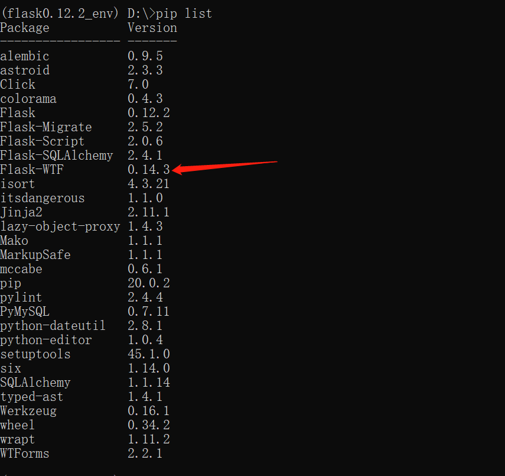

### 513.【Flask文件上传】使用flask_wtf验证上传的文件


### 文件上传笔记
* 1.在模版中，form表单中，需要指定`encotype='multipart/form-data'`才能上传文件。
* 2.在后台如果想要获取上传的文件，那么应该使用`request.files.get('avatar')`来获取。
* 3.保存文件之前，先要使用`werkzeug.utils.secure_filename`来对上传上来的文件名进行一个过滤。
    这样才能保证不会有安全问题。 
* 4.获取到上传上来的文件后，使用`avatar.save(路径)`方法来保存文件。
* 5.从服务器上读取文件，应该定义一个url与视图函数，来获取指定的文件。在这个视图函数中，
    使用`send_from_directory(文件的目录,文件名)`来获取文件。
    
### 安装`flask_wtf`
```shell script
pip install Flask-WTF
```



### 对上传文件使用表单验证：
* 1.定义表单的时候，对文件的字段，需要采用`FileField`这个类型。
* 2.验证器应该从`flask_wtf.file`中导入。
    `flask_wtf.file.FileRequired`是用来验证文件上传是否为空。
    `flask_wtf.file.FileAllowed`用来验证上传的文件的后缀名。
* 3.在视图文件中，使用`from werkzeug.datastructures import CombinedMultiDict`来
    把`request.form`与`request.files`来进行合并。再传给表单来验证。
    
    
### 全部示例代码
#### HTML部分
```jinja2
<!DOCTYPE html>
<html lang="en">
<head>
    <meta charset="UTF-8">
    <title>使用flask_wtf验证上传的文件</title>
</head>
<body>
    <h3>使用flask_wtf验证上传的文件</h3>
    <form action="{{ url_for('upload') }}" method="post" enctype="multipart/form-data">
        <table>
            <tbody>
                <tr>
                    <td>上传头像</td>
                    <td><input type="file" name="avatar"></td>
                </tr>
                <tr>
                    <td>用户昵称</td>
                    <td><input type="text" name="username"></td>
                </tr>
                <tr>
                    <td></td>
                    <td><button type="submit">提交</button></td>
                </tr>
            </tbody>
        </table>
    </form>
</body>
</html>
```

#### 表单验证器部分
```python
from wtforms import Form, StringField, FileField
from wtforms.validators import InputRequired
from flask_wtf.file import FileRequired, FileAllowed


# TODO: 定义upload页面表单校验器
class UploadForm(Form):
    username = StringField(validators=[InputRequired(message='用户名不能为空')])
    """
    `flask_wtf.file.FileRequired`是用来验证文件上传是否为空。
    `flask_wtf.file.FileAllowed`用来验证上传的文件的后缀名。
    """
    avatar = FileField(validators=[FileRequired(), FileAllowed(upload_set=['jpg', 'png', 'gif'],
                                                               message="上传图片格式不符合要求")])

```

#### app.py部分
```python
from flask import Flask, render_template, request, send_from_directory
from werkzeug.utils import secure_filename
# TODO: CombinedMultiDict 来把`request.form`与`request.files`来进行合并
from werkzeug.datastructures import CombinedMultiDict
from validators import UploadForm
import os

app = Flask(__name__)
FILE_PATH = os.path.join(os.path.dirname(__file__), 'images')


@app.route('/')
def index():
    return render_template('index.html')


@app.route('/upload/', methods=['GET', 'POST'])
def upload():
    if request.method == 'GET':
        return render_template('upload.html')
    else:
        # TODO: CombinedMultiDict([ImmutableMultiDict([('username', '')]), ImmutableMultiDict([('avatar',
        #  <FileStorage: '0.gif' ('image/gif')>)])])
        # print(CombinedMultiDict(dicts=[request.form, request.files]))
        # TODO: <class 'werkzeug.datastructures.CombinedMultiDict'>
        # print(type(CombinedMultiDict(dicts=[request.form, request.files])))
        form = UploadForm(CombinedMultiDict(dicts=[request.form, request.files]))
        if form.validate():
            # TODO: 获取方式一
            # username = request.form.get('username')
            # avatar = request.files.get('avatar')
            # TODO: 获取方式二
            username = form.username.data
            avatar = form.avatar.data
            filename = secure_filename(avatar.filename)
            avatar.save(os.path.join(FILE_PATH, filename))
            return '文件上传成功'
        else:
            print(form.errors)
            return 'fail'


@app.route('/images/<filename>', methods=['GET'])
def getImage(filename):
    return send_from_directory(FILE_PATH, filename)


if __name__ == '__main__':
    app.run(debug=True)
```
