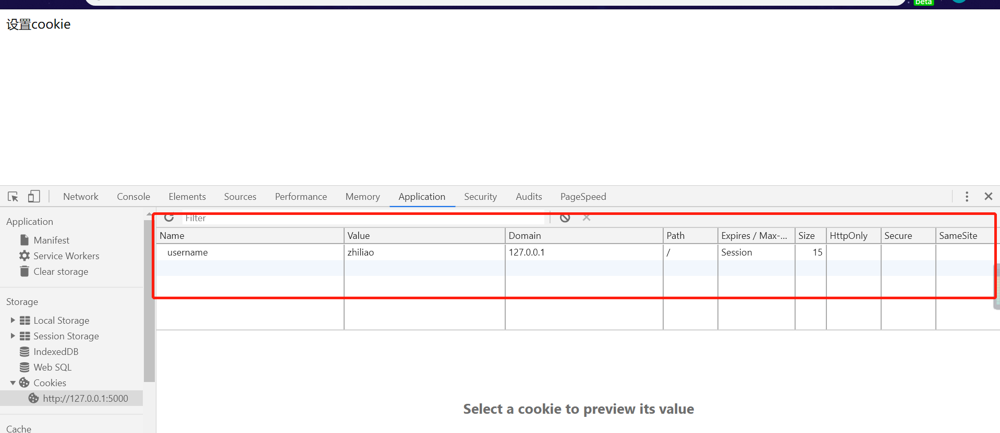
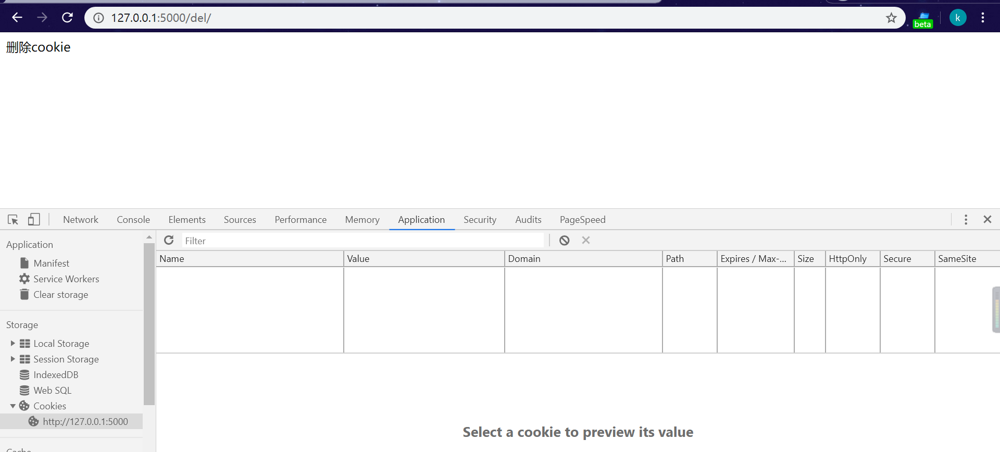

### 515.【Flask Cookie】Flask设置和删除cookie[链接](http://wangkaixiang.cn/python-flask/di-shi-yi-zhang-ff1a-cookie-he-session.html)

### flask操作cookie：
* 1.设置cookie：设置cookie是应该在Response的对象上设置。`flask.Response`对象有一个
`set_cookie`方法，可以通过这个方法来设置`cookie`信息。在Chrome浏览器中查看cookie的方式：
    * 右键->检查->Network->重新加载页面->找到请求，然后查看Response Headers中的cookie
    * 点击url输入框左边的信息icon，然后找到相应的域名，再展开查看cookie。
    * 在Chrome的设置界面->高级设置->内容设置->所有cookie->找到当前域名下的cookie。 
* 2.删除cookie：通过`Response.delete_cookie`，指定cookie的key，就可以删除cookie了。


### 1.设置cookie
```text
@app.route('/')
def index():
    res = Response(response='设置cookie')
    res.set_cookie(key='username', value='zhiliao')
    return res
```


### 2.删除cookie
```text
@app.route('/del/')
def delcookie():
    res = Response(response='删除cookie')
    res.delete_cookie(key='username')
    return res
```


### 全部代码示例
```python
from flask import Flask, Response

app = Flask(__name__)


@app.route('/set/')
def setcookie():
    res = Response(response='设置cookie')
    res.set_cookie(key='username', value='zhiliao')
    return res


@app.route('/del/')
def delcookie():
    res = Response(response='删除cookie')
    res.delete_cookie(key='username')
    return res


if __name__ == '__main__':
    app.run(debug=True)
```