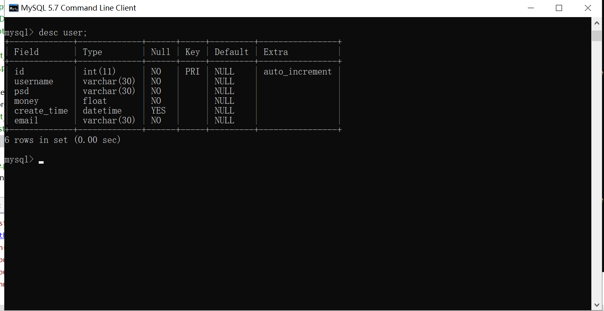
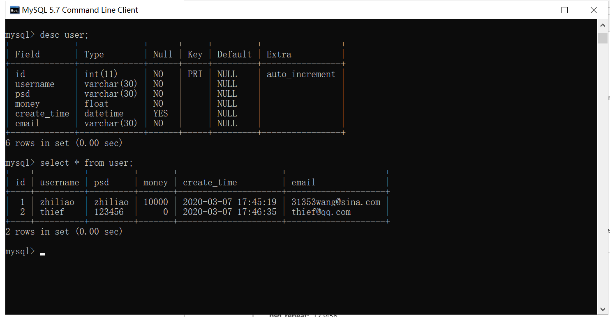

### 521.【CSRF攻击与防御】实战项目-中国工商银行注册功能完成[链接](http://wangkaixiang.cn/python-flask/di-shi-liu-zhang-ff1a-csrf-gong-ji.html)

### 创建User模型
```python
import os
import sys
from datetime import datetime

sys.path.append(os.path.dirname(os.path.dirname(__file__)))

from db.db import db


# TODO: 定义User模型
class User(db.Model):
    __tablename__ = 'user'
    id = db.Column(db.Integer, primary_key=True, autoincrement=True)
    email = db.Column(db.String(30), nullable=False)
    username = db.Column(db.String(30), nullable=False)
    psd = db.Column(db.String(30), nullable=False)
    money = db.Column(db.Float, nullable=False, default=0)
    create_time = db.Column(db.DATETIME, default=datetime.now)
```

### 初始化`manage.py`迁移文件
> python manage.py db ini
```shell script
(flask0.12.2_env) D:\github\python-flask\521>python manage.py db init
```

### 将模型的映射添加到文件中
> python manage.py db migrate
```shell script
(flask0.12.2_env) D:\github\python-flask\521>python manage.py db migrate
```

### 将映射文件映射到数据库中
> python manage.py db upgrade
```shell script
(flask0.12.2_env) D:\github\python-flask\521>python manage.py db upgrade
```



### 通过注册页面提交注册2个用户
