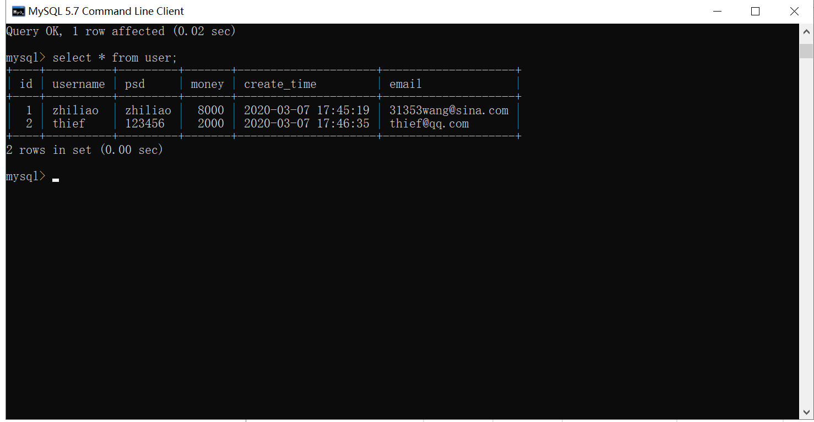

### 522.【CSRF攻击与防御】实战项目-中国工商银行登录和转账实现[链接](http://wangkaixiang.cn/python-flask/di-shi-liu-zhang-ff1a-csrf-gong-ji.html)

### 登录类视图
```text
# TODO: 登录类视图
class LoginView(views.MethodView):
    def get(self):
        return render_template('login.html')

    def post(self):
        form = LoginValidator(request.form)
        if form.validate():
            email = form.email.data
            psd = form.psd.data
            user = User.query.filter(User.email == email, User.psd == psd).first()
            if user:
                # TODO: 登录成功存储user.id到session中
                session['user_id'] = user.id
                return '登录成功...'
            else:
                return '账号或密码错误...'
        else:
            print(form.errors)
            return '登录失败...'

app.add_url_rule(rule='/login/', endpoint='login', view_func=LoginView.as_view('login'))
```

### 转账类视图
```text
# TODO: 转账类视图
class TransferView(views.MethodView):
    def get(self):
        return render_template('transfer.html')

    def post(self):
        form = TransferValidator(request.form)
        if form.validate():
            email = form.email.data
            money = form.money.data
            user = User.query.filter(User.email == email).first()
            if user:
                myself = User.query.filter(User.id == session.get('user_id')).first()
                if myself:
                    # TODO: 余额充足发起转账
                    if myself.money > money:
                        myself.money -= money
                        user.money += money
                        db.session.commit()
                        return '转账成功...'
                    else:
                        return '账户余额不足...'
                else:
                    return '转账失败请登录...'
            else:
                return '收款人不存在...'
        else:
            return '转账失败...'

app.add_url_rule(rule='/transfer/', endpoint='transfer', view_func=TransferView.as_view('transfer'))
```

### 转账成功示例
