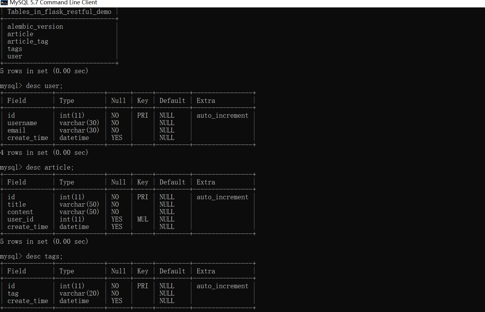
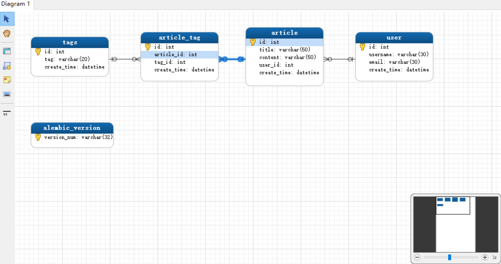
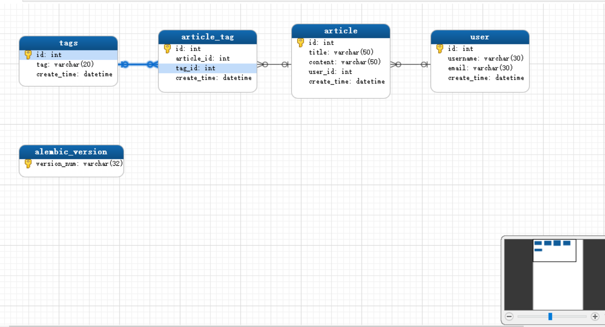
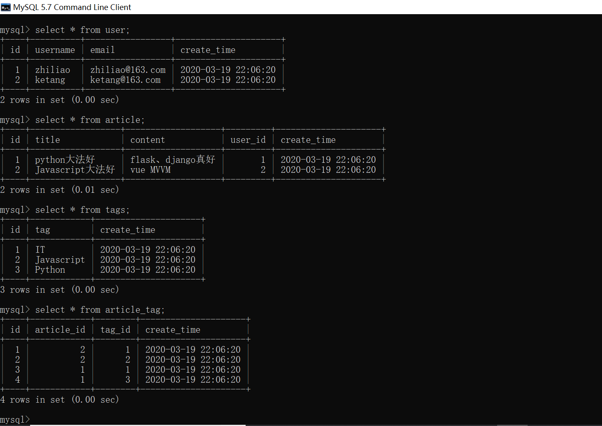

### 539.【Flask Restful】Flask-Restful标准化返回参数（2）[链接](http://wangkaixiang.cn/python-flask/di-shi-si-zhang-ff1a-flask/di-er-jie-ff1a-flask-restful-cha-jian.html)

### 1.创建数据库模型
```python
from db import db
from datetime import datetime


# TODO: 定义用户模型
class User(db.Model):
    __tablename__ = 'user'
    id = db.Column(db.Integer, primary_key=True, autoincrement=True)
    username = db.Column(db.String(30), nullable=False)
    email = db.Column(db.String(30), nullable=False)
    create_time = db.Column(db.DATETIME, default=datetime.now)


# TODO: 定义标签模型
class Tags(db.Model):
    __tablename__ = 'tags'
    id = db.Column(db.Integer, primary_key=True, autoincrement=True)
    tag = db.Column(db.String(20), nullable=False)
    create_time = db.Column(db.DATETIME, default=datetime.now)


# TODO: 定义文章标签关联表
ArticleTags = db.Table('article_tag',
    db.Column('id', db.Integer, primary_key=True, autoincrement=True),
    db.Column('article_id', db.Integer, db.ForeignKey('article.id')),
    db.Column('tag_id', db.Integer, db.ForeignKey('tags.id')),
    db.Column('create_time', db.DATETIME, default=datetime.now)
)


# TODO: 定义文章模型
class Article(db.Model):
    __tablename__ = 'article'
    id = db.Column(db.Integer, primary_key=True, autoincrement=True)
    title = db.Column(db.String(50), nullable=False)
    content = db.Column(db.String(50), nullable=False)
    user_id = db.Column(db.Integer, db.ForeignKey('user.id'))
    create_time = db.Column(db.DATETIME, default=datetime.now)

    author = db.relationship('User', backref=db.backref('articles', uselist=True), uselist=False)
    tags = db.relationship('Tags', secondary=ArticleTags, backref=db.backref('article', uselist=True), uselist=True)
```

#### 数据库结构截图


### 2.逆向数据库到模型



### 3.提交测试数据
```python
@app.route('/')
def index():
    user1 = User(username='zhiliao', email='zhiliao@163.com')
    user2 = User(username='ketang', email='ketang@163.com')
    article1 = Article(title='python大法好', content='flask、django真好')
    article2 = Article(title='Javascript大法好', content='vue MVVM')
    tag1 = Tags(tag='IT')
    tag2 = Tags(tag='Python')
    tag3 = Tags(tag='Javascript')
    article1.author = user1
    article1.tags.append(tag1)
    article1.tags.append(tag2)
    article2.author = user2
    article2.tags.append(tag1)
    article2.tags.append(tag3)
    # TODO: 提交数据
    db.session.add_all([article1, article2])
    db.session.commit()
    return 'hello world!...'
```

#### 数据库数据示例


### 4. 标准化复杂参数示例 -- 根据文章返回信息
```python
class ArtcicleView(Resource):
    resource_fileds = {
        "user_id": fields.Integer,
        "author": fields.Nested({  # TODO: 复杂结构 fields.Nested 返回字典
            "username": fields.String,
            "email": fields.String,
        }),
        "title": fields.String,
        "content": fields.String,
        "tags": fields.List(fields.Nested({  # TODO: 复杂结构 fields.List 返回列表
            "tag": fields.String
        })),
        "read_count": fields.Integer(default=80),  # TODO: 默认值
        "article_create_time": fields.String(attribute='create_time'),
        # todo: 重命名属性 create_time 以 article_create_time返回
    }

    @marshal_with(resource_fileds)
    def get(self, art_id):
        return Article.query.get(art_id)


api.add_resource(ArtcicleView, '/article/<art_id>/', endpoint='article')
```

#### 返回json示例1
> http://127.0.0.1:5000/article/1/
```json
{
    "user_id": 1,
    "author": {
        "username": "zhiliao",
        "email": "zhiliao@163.com"
    },
    "title": "python大法好",
    "content": "flask、django真好",
    "tags": [
        {
            "tag": "IT"
        },
        {
            "tag": "Python"
        }
    ],
    "read_count": 80,
    "article_create_time": "2020-03-19 22:06:20"
}
```

#### 返回json示例2
> http://127.0.0.1:5000/article/2/
```json
{
    "user_id": 2,
    "author": {
        "username": "ketang",
        "email": "ketang@163.com"
    },
    "title": "Javascript大法好",
    "content": "vue MVVM",
    "tags": [
        {
            "tag": "IT"
        },
        {
            "tag": "Javascript"
        }
    ],
    "read_count": 80,
    "article_create_time": "2020-03-19 22:06:20"
}
```

### 5. 标准化复杂参数示例 -- 根据标签返回信息
```python

```

#### 返回示例1
> 
```json

```

#### 返回示例2
> 
```json

```