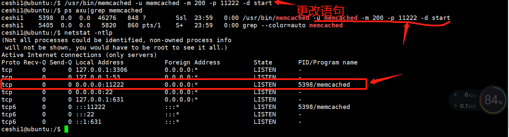
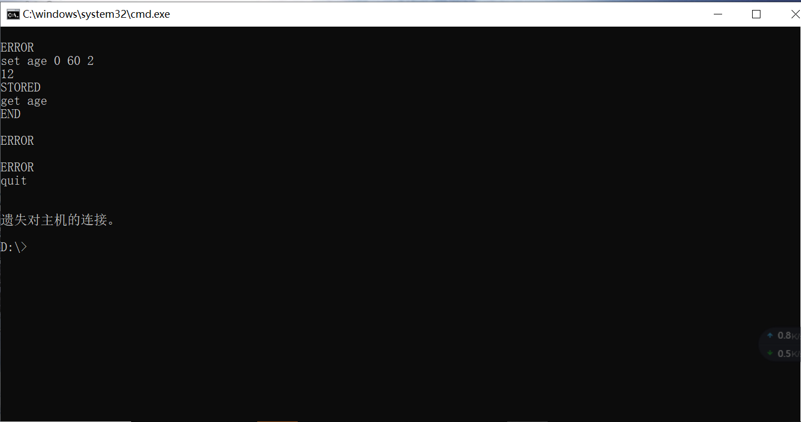

### 542.【memcached】memcached的安装和参数详解[链接](http://wangkaixiang.cn/python-flask/di-shi-er-zhang-ff1a-memcached-jiao-cheng.html)

### 1.Ubuntu安装`memcached`
```shell
sudo apt-get install libcache-memcached-perl
sudo apt-get install memcached
```

### 2.Ubuntu启动`memcached`
```shell
sudo service memcached start
```

### 3.Ubuntu验证是否启动了`memcached`(查看进程)
```
ps axu|grep memcached
```

#### 3.1 启动正常如下可见进程号
```shell
ceshi1@ubuntu:/$ ps axu|grep memcached
memcache  3779  0.0  0.0  46364  1068 ?        Sl   22:48   0:00 /usr/bin/memcached -m 64 -p 11211 -u memcache -l 127.0.0.1
ceshi1    5027  0.0  0.0   5820   856 pts/1    S+   23:00   0:00 grep --color=auto memcached
```

### 4.`memcached`下常用参数配置
* -d：这个参数是让memcached在后台运行。
* -m：指定占用多少内存。以M为单位，默认为64M。
* -p：指定占用的端口。默认端口是11211。
* -l：别的机器可以通过哪个ip地址连接到我这台服务器。如果是通过`service memcached start`的方式，那么只能通过本机连接。如果想要让别的机器连接，就必须设置`-l 0.0.0.0`。
> 注意事项：如果想要使用以上参数来指定一些配置信息，那么不能使用`service memcached start`，而应该使用`/usr/bin/memcached`的方式来运行。比如`/usr/bin/memcached -u memcache -m 1024 -p 11222 start`。

#### 试验常用参数前，请先杀掉所有`memcached`进程
```shell
sudo killall memcached

ceshi1@ubuntu:/$ sudo killall memcached
ceshi1@ubuntu:/$ ps axu|grep memcached
ceshi1    5350  0.0  0.0   5820   860 pts/1    S+   23:40   0:00 grep --color=auto memcached
```

#### 4.1 `memcached -d`：这个参数是让memcached在后台运行。
```shell
/usr/bin/memcached -u memcached -d start
```

##### 未在后台运行如图。`Ctrl+C`退出


##### 在后台运行如图


#### 4.2 `memcached -m`：指定占用多少内存。以M为单位，默认为64M。
```shell
/usr/bin/memcached -u memcached -d -m 200 start
```

##### 配置内存后截图


#### 4.3 `memcached -p`：指定占用的端口。默认端口是`11211`，更改为`11222`
```shell
/usr/bin/memcached -u memcached -m 200 -p 11222 -d start
```

##### 查看当前所有tcp端口
```shell
netstat -ntlp
```
##### 默认`11211`端口截图(未更改前)


##### 更改默认端口`11211`为`11222`端口后截图(更改后)


#### 4.4 `memcached -l`：别的机器可以通过哪个ip地址连接到我这台服务器。
> 如果是通过`service memcached start`的方式，那么只能通过本机连接。如果想要让别的机器连接，就必须设置`-l 0.0.0.0`。
```shell
/usr/bin/memcached -u memcached -m 200 -d -l 0.0.0.0 start
```

##### 4.1 `service memcached start`命令启动方式
```shell
sudo service memcached start
```

##### 4.2 本机链接`memcached`设置读取数据
> `telnet ip地址 [11211]`
* 设置数据：`set key flas(是否压缩) timeout value_length`
    ```shell
    set username 0 120 3
    abc
    ```
* 读取数据：`get key`
    ```shell
    get username
    abc
    ```

##### 4.3 未允许别的机器通过`telnet ip地址 11211`链接`memcached`
> windows下：'telnet' 不是内部或外部命令，也不是可运行的程序
或批处理文件。解决链接：[地址](https://jingyan.baidu.com/article/375c8e19bff04625f3a22961.html)

##### 4.4 windows宿主机链接失败


##### 允许外部机器设置`-l 0.0.0.0`后windows宿主机链接成功
