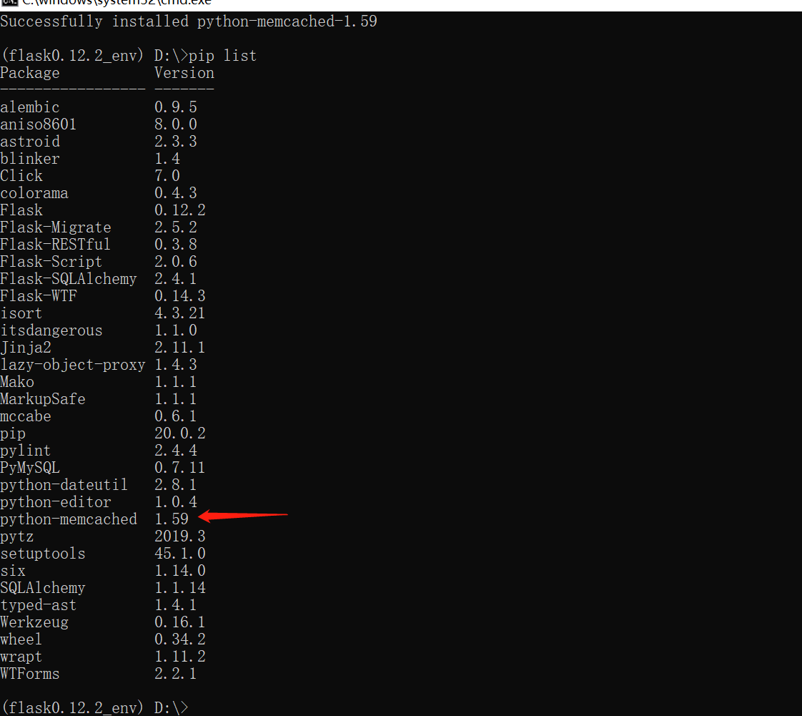

### 544.【memcached】Python操作memcached[链接](http://wangkaixiang.cn/python-flask/di-shi-er-zhang-ff1a-memcached-jiao-cheng.html)

### 1.安装：`python-memcached`
```shell
pip install python-memcached
```


### 2.建立连接
```python
import memcache

mc = memcache.Client(['192.168.184.128:11211', '192.168.184.130:11211'], debug=True)
```

### 3.设置数据
```python
# TODO: 设置数据
mc.set('username', 'zhiliao', time=60 * 5)
mc.set_multi({'address': 'zhejianghangzhou', 'age': 20, 'country': 'china', 'job': 'IT developer', 'sex': 'man'}, time=60 * 5)
```

### 4.读取数据
```python
# TODO: 读取数据
username = mc.get('username')
address = mc.get('address')
country = mc.get('country')
print(username)  # TODO: zhiliao
print(address)  # TODO: zhejianghangzhou
print(country)  # TODO: china
```

### 5.删除数据
```python
mc.delete('username')
username = mc.get('username')
print(username)  # TODO: None
```

### 6.自增长
```python
# TODO: 自增长
mc.set('total', 1, time=60 * 5)
# TODO: 默认自增长1
mc.incr('total', delta=5)
print(mc.get('total'))  # TODO: 6
```

### 7.自减少
```python
# TODO: 自减少，默认自减少1
mc.decr('total', delta=3)
print(mc.get('total'))  # TODO: 3
```