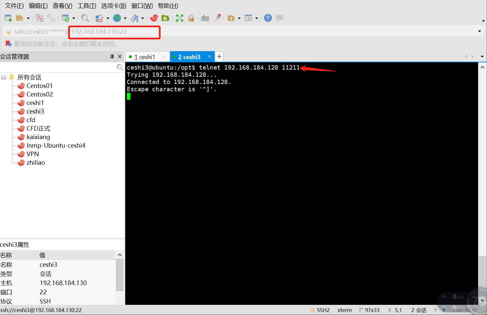

### 545.【memcached】memcached的安全机制[链接](http://wangkaixiang.cn/python-flask/di-shi-er-zhang-ff1a-memcached-jiao-cheng.html)

### memcached的安全性
> memcached的操作不需要任何用户名和密码，只需要知道memcached服务器的ip地址和端口号即可。因此memcached使用的时候尤其要注意他的安全性。这里提供两种安全的解决方案。
* 1.使用`-l`参数设置为只有本地可以连接：这种方式，就只能通过本机才能连接，别的机器都不能访问，可以达到最好的安全性。
* 2.用防火墙，关闭`11211`端口，外面也不能访问
```shell
ufw enable # 开启防火墙
ufw disable # 关闭防火墙
ufw default deny # 防火墙以禁止的方式打开，默认是关闭那些没有开启的端口
ufw deny 端口号 # 关闭某个端口
ufw allow 端口号 # 开启某个端口
```

### 未关闭防火墙前允许外部主机进行`memcached`链接


### 关闭防火墙
> 语法：ufw deny 端口号
```shell
ceshi1@ubuntu:/$ sudo ufw deny 11211
Rules updated
Rules updated (v6)
```