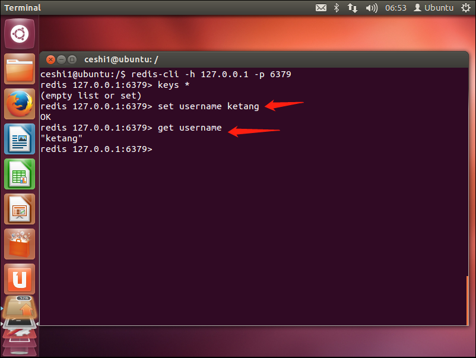

### 552.【Redis】Redis的事务操作[链接](http://wangkaixiang.cn/python-flask/di-shi-sizhang-ff1a-redis-jiao-cheng.html)

### 事务操作
> Redis事务可以一次执行多个命令，事务具有以下特征：
* 隔离操作：事务中的所有命令都会序列化、按顺序地执行，不会被其他命令打扰。
* 原子操作：事务中的命令要么全部被执行，要么全部都不执行。

### 1.开启一个事务
> 语法：multi

> 以后执行的所有命令，都在这个事务中执行的。
```shell
redis 127.0.0.1:6379> multi
OK
```

### 2.执行事务
> 语法：exec

> 会将在`multi`和`exec`中的操作一并提交。
```shell
redis 127.0.0.1:6379> multi
OK
redis 127.0.0.1:6379> set username zhiliao
QUEUED
redis 127.0.0.1:6379> get username
QUEUED
redis 127.0.0.1:6379> exec
1) OK
2) "zhiliao"
```

### 3.取消事务
> 语法：discard

> 会将`multi`后的所有命令取消
```shell
redis 127.0.0.1:6379> multi
OK
redis 127.0.0.1:6379> set username zhiliao
QUEUED
redis 127.0.0.1:6379> get username
QUEUED
redis 127.0.0.1:6379> discard
OK
redis 127.0.0.1:6379> keys *
(empty list or set)
```

### 4.监视一个或者多个key
> 语法： watch key1 key2...

> 监视一个(或多个)key，如果在事务执行之前这个(或这些) key被其他命令所改动，那么事务将被打断

#### 4.1 XShell`未使用exec进行事务执行`
```shell
redis 127.0.0.1:6379> keys *
(empty list or set)
redis 127.0.0.1:6379> watch username
OK
redis 127.0.0.1:6379> multi
OK
redis 127.0.0.1:6379> set username zhiliao
QUEUED
redis 127.0.0.1:6379> get username
QUEUED
```

#### 4.2 Ubuntu虚拟机主机


#### 4.3 XShell`使用exec进行事务执行`
```shell
redis 127.0.0.1:6379> keys *
(empty list or set)
redis 127.0.0.1:6379> watch username
OK
redis 127.0.0.1:6379> multi
OK
redis 127.0.0.1:6379> set username zhiliao
QUEUED
redis 127.0.0.1:6379> get username
QUEUED

# TODO: 不能执行
redis 127.0.0.1:6379> exec
(nil)
```

### 5.取消所有key的监视
> 语法：unwatch
```shell
redis 127.0.0.1:6379> unwatch
OK
redis 127.0.0.1:6379> multi
OK
redis 127.0.0.1:6379> set username zhiliao
QUEUED
redis 127.0.0.1:6379> get username
QUEUED
redis 127.0.0.1:6379> exec
1) OK
2) "zhiliao"
```