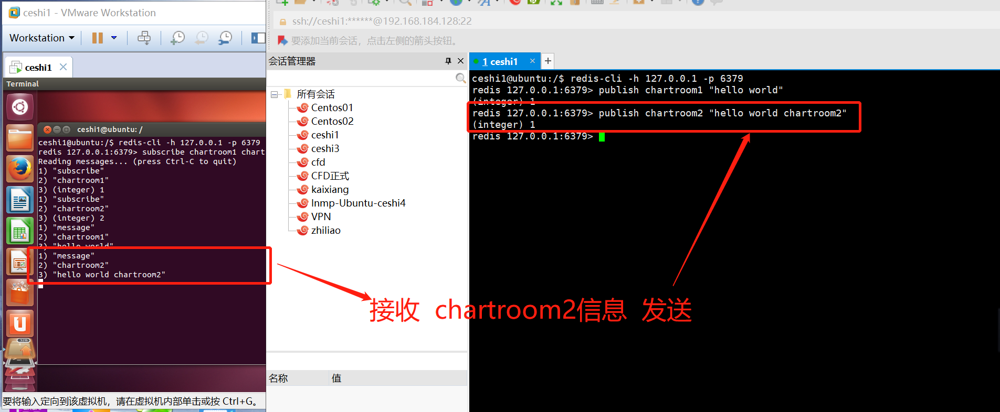

### 553.【Redis】Redis的发布和订阅操作[链接](http://wangkaixiang.cn/python-flask/di-shi-sizhang-ff1a-redis-jiao-cheng.html)

### 发布/订阅操作
> 注意：主机1先订阅后，主机2在发布

### 1.订阅某个或多个频道的消息
> 语法：subscribe channel(频道1) channel2(频道2)...
```shell
redis 127.0.0.1:6379> subscribe chartroom1 chartroom2
1) "subscribe"
2) "chartroom1"
3) (integer) 1
1) "subscribe"
2) "chartroom2"
3) (integer) 2
```

### 2.给某个频道发布消息
> 语法：publish channel(频道1) message
>
> 语法：publish channel2(频道2) message
```shell
redis 127.0.0.1:6379> publish chartroom1 "hello world"
(integer) 1
redis 127.0.0.1:6379> publish chartroom2 "hello world chartroom2"
(integer) 1
```

### 3.多次发布结果测试截图


