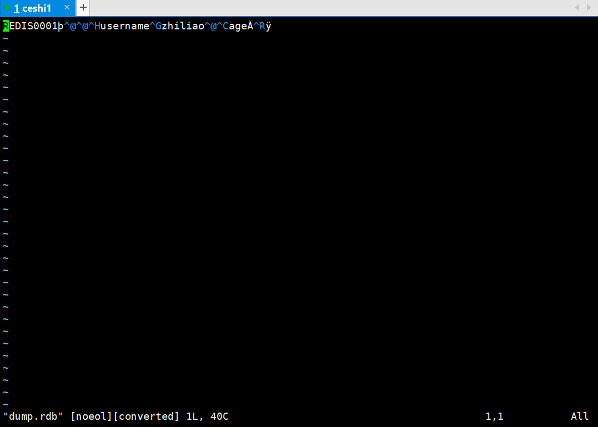
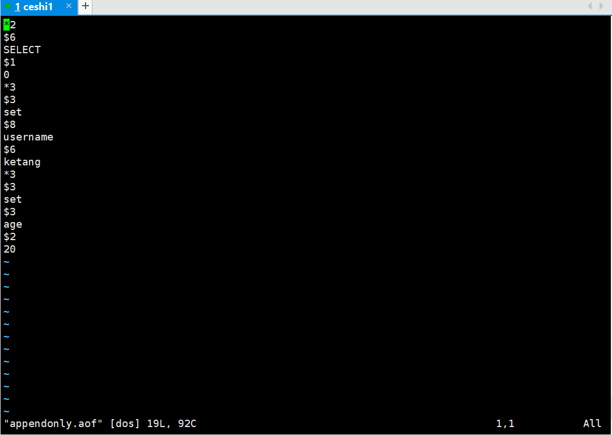

### 554.【Redis】RDB和AOF的两种数据持久化机制 ---  AOF部分[链接](http://wangkaixiang.cn/python-flask/di-shi-sizhang-ff1a-redis-jiao-cheng.html)

### 持久化
> redis提供了两种数据备份方式
* 一种是RDB
* 一种是AOF


| | RDB | AOF | 
| :----- | :----- | :----- | 
| 开启关闭 | 开启：默认开启。关闭：把配置文件中所有的save都注释，就是关闭了。 | 开启：在配置文件中appendonly yes即开启了aof，为no关闭。 | 
| 同步机制 | 可以指定某个时间内发生多少个命令进行同步。比如1分钟内发生了2次命令，就做一次同步。 | 每秒同步或者每次发生命令后同步 | 
| 存储内容 | 存储的是redis里面的具体的值 | 存储的是执行的更新数据的操作命令 | 
| 存储文件的路径 | 根据dir以及dbfilename来指定路径和具体的文件名 | 根据dir以及appendfilename来指定具体的路径和文件名 | 
| 优点 | （1）存储数据到文件中会进行压缩，文件体积比aof小。（2）因为存储的是redis具体的值，并且会经过压缩，因此在恢复的时候速度比AOF快。（3）非常适用于备份。 | （1）AOF的策略是每秒钟或者每次发生写操作的时候都会同步，因此即使服务器故障，最多只会丢失1秒的数据。 （2）AOF存储的是Redis命令，并且是直接追加到aof文件后面，因此每次备份的时候只要添加新的数据进去就可以了。（3）如果AOF文件比较大了，那么Redis会进行重写，只保留最小的命令集合。 | 
| 缺点 | （1）RDB在多少时间内发生了多少写操作的时候就会出发同步机制，因为采用压缩机制，RDB在同步的时候都重新保存整个Redis中的数据，因此你一般会设置在最少5分钟才保存一次数据。在这种情况下，一旦服务器故障，会造成5分钟的数据丢失。（2）在数据保存进RDB的时候，Redis会fork出一个子进程用来同步，在数据量比较大的时候，可能会非常耗时。 | （1）AOF文件因为没有压缩，因此体积比RDB大。 （2）AOF是在每秒或者每次写操作都进行备份，因此如果并发量比较大，效率可能有点慢。（3）AOF文件因为存储的是命令，因此在灾难恢复的时候Redis会重新运行AOF中的命令，速度不及RDB。
| | 更多 | http://redisdoc.com/topic/persistence.html#redis | |


### 1.开启AOF持久化模式
> 在配置文件`/etc/redis/redis.conf`中appendonly yes即开启了aof，为no关闭。默认关闭

#### 关闭`RDB`模式
```
################################ SNAPSHOTTING  #################################
#
# Save the DB on disk:
#
#   save <seconds> <changes>
#
#   Will save the DB if both the given number of seconds and the given
#   number of write operations against the DB occurred.
#
#   In the example below the behaviour will be to save:
#   after 900 sec (15 min) if at least 1 key changed
#   after 300 sec (5 min) if at least 10 keys changed
#   after 60 sec if at least 10000 keys changed
#
#   Note: you can disable saving at all commenting all the "save" lines.

# save 900 1
# save 300 10
# save 60 10000
```

#### 开启`AOF`模式
```
# log file in background when it gets too big.

appendonly yes

# The name of the append only file (default: "appendonly.aof")
# appendfilename appendonly.aof

# The fsync() call tells the Operating System to actually write data on disk
# instead to wait for more data in the output buffer. Some OS will really flush 
# data on disk, some other OS will just try to do it ASAP.
#
# Redis supports three different modes:
#
# no: don't fsync, just let the OS flush the data when it wants. Faster.
# always: fsync after every write to the append only log . Slow, Safest.
# everysec: fsync only if one second passed since the last fsync. Compromise.
#
# The default is "everysec" that's usually the right compromise between
# speed and data safety. It's up to you to understand if you can relax this to
# "no" that will will let the operating system flush the output buffer when
# it wants, for better performances (but if you can live with the idea of
# some data loss consider the default persistence mode that's snapshotting),
# or on the contrary, use "always" that's very slow but a bit safer than
# everysec.
#
# If unsure, use "everysec".

# appendfsync always
appendfsync everysec
# appendfsync no
```


### 2.保存更改后，重启`redis-server`
> 命令：`sudo redis-server restart`
```shell
ceshi1@ubuntu:/var/lib/redis$ sudo service redis-server restart
Stopping redis-server: redis-server.
Starting redis-server: redis-server.
ceshi1@ubuntu:/var/lib/redis$ redis-cli -h 127.0.0.1 -p 6379
redis 127.0.0.1:6379> keys *
(empty list or set)
redis 127.0.0.1:6379> set username ketang
OK
redis 127.0.0.1:6379> set age 20
OK
redis 127.0.0.1:6379> quit
```

### 3.对比`appendonly.aof`和`dump.rdb`文件

#### `dump.rdb`文件
* 存储的是redis里面的具体的值
* 1.存储数据到文件中会进行压缩，文件体积比aof小。
* 2.因为存储的是redis具体的值，并且会经过压缩，因此在恢复的时候速度比AOF快。
* 3.非常适用于备份。


#### `appendonly.aof`文件
* 存储的是执行的更新数据的操作命令
* 1.AOF的策略是每秒钟或者每次发生写操作的时候都会同步，因此即使服务器故障，最多只会丢失1秒的数据。 
* 2.AOF存储的是Redis命令，并且是直接追加到aof文件后面，因此每次备份的时候只要添加新的数据进去就可以了。
* 3.如果AOF文件比较大了，那么Redis会进行重写，只保留最小的命令集合。
