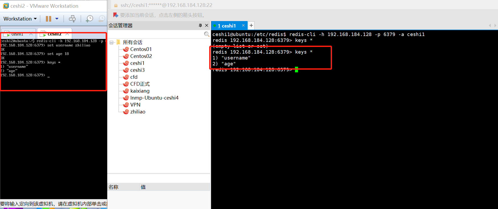

### 556.【Redis】其他机器连接本机redis[链接](http://wangkaixiang.cn/python-flask/di-shi-sizhang-ff1a-redis-jiao-cheng.html)

### 其他机器连接redis
> 如果想要让其他机器连接本机的redis服务器，那么应该在`/etc/redis/redis.conf`配置文件中，指定`bind 本机的ip地址`。这样别的机器就能连接成功。不像是网上说的，要`指定对方的ip地址(错误)`。

### 本机部分
#### `192.168.184.128`修改`bind 本机的ip地址`
> 注释掉`bind`整句语句
```
# When running daemonized, Redis writes a pid file in /var/run/redis.pid by
# default. You can specify a custom pid file location here.
pidfile /var/run/redis/redis-server.pid

# Accept connections on the specified port, default is 6379.
# If port 0 is specified Redis will not listen on a TCP socket.
port 6379

# If you want you can bind a single interface, if the bind option is not
# specified all the interfaces will listen for incoming connections.
#
# 本机的ID地址
# bind 192.168.184.128
```

#### `192.168.184.128 redis-server`重启
> 命令：`service redis-server restart`
```shell
ceshi1@ubuntu:/etc/redis$ sudo service redis-server restart
Stopping redis-server: redis-server.
Starting redis-server: redis-server.
```

### `redis-cli`连接`redis`
```
ceshi1@ubuntu:/etc/redis$ redis-cli -h 192.168.184.128 -p 6379 -a ceshi1
redis 192.168.184.128:6379> keys *
(empty list or set)
```

### `192.168.184.129`虚拟机机部分
